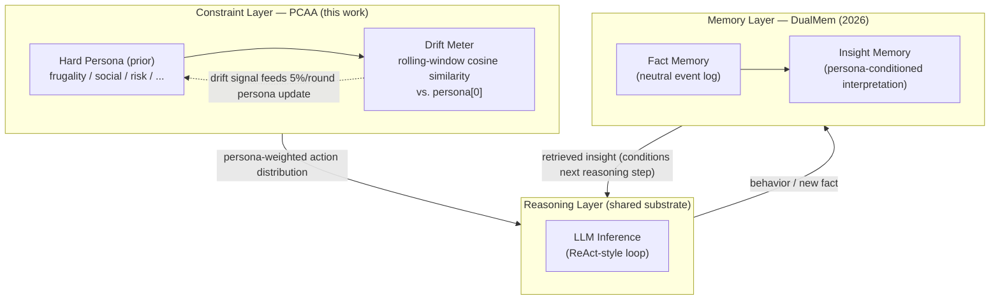

# PCAA: Persona-Constrained Agent Architecture
### Working Draft — short / workshop paper

> Status: Phase 1 MVP complete (3 personas × 3 conditions × 5 scenarios, 10- and 20-round settings, DeepSeek-V3 behavior generation, Kimi/Moonshot LLM-as-judge). Sections marked `[TODO]` still depend on the full Phase 2 experiment (10 personas, 100 rounds).

---

## Abstract

Long-horizon LLM agent simulations face a persona-homogenization problem: without an explicit constraint, agent behavior either collapses toward the LLM's modal response or drifts away from its assigned character over time. We propose **Persona-Constrained Agent Architecture (PCAA)**, which treats persona as a Bayesian prior that regularizes the action-selection distribution, with persona drift modeled as an explicit, measurable, slowly-updating quantity (95% inheritance / 5% drift per round) — in contrast to architectures (e.g. Generative Agents, DualMem) in which persona is an emergent or memory-conditioned property with no first-class drift signal. In a 3-persona MVP, blinded LLM-judge pairwise comparisons ("which trace looks more human") favor PCAA over a memory-impoverished text-only baseline 67%/33% over 10 rounds and 89%/11% over 20 rounds, with the largest gain on the persona archetype (`cautious_stable`) that initially showed the opposite result before two fixes: a drift-rate bug and a prompt change that reframed persona values as probabilistic tendencies rather than hard rules. However, when the baseline is instead given a more faithful Generative-Agents-style memory architecture (timestamped memory stream, recency/importance/relevance retrieval, periodic reflection, per-round planning) but still no structured persona layer, PCAA's 10-round win rate drops to 44%, losing on two of three persona archetypes — indicating that PCAA's advantage in the simpler comparison is partly attributable to the baseline's weak memory, not solely to the absence of explicit persona constraint. Our vector-based consistency/diversity/stability metrics — computed over discretized action categories — do not reproduce the first gap but do track the second, suggesting the metrics' diagnostic power depends on what is being compared against. We report both the favorable and unfavorable comparisons as found, and identify combining PCAA's constraint layer with a Generative-Agents-style memory stream (rather than treating the two as competitors) as the most promising next step.

## 1. Introduction
`[TODO]`

We propose **Persona-Constrained Agent Architecture (PCAA)**, which treats persona as a Bayesian prior constraining behavior generation, rather than a posterior label emergent from behavior — addressing the agent homogenization problem in long-term multi-agent simulations.

The central question motivating PCAA is: *can LLM agents maintain a stable identity while remaining socially adaptive?* — a question that has emerged independently across the 2024–2026 literature on identity drift, agent conformity, and homogenization (§2.4). Mischel & Shoda's (1995) Cognitive-Affective Personality System (CAPS) formalizes exactly this dual requirement: person-stable *if-then* dispositions that nevertheless respond differently to situational cues. PCAA is offered as *a persona-based approximation toward stable agent identity* — it does not fully solve the identity problem, but isolates and validates the constraint-layer effect on behavioral stability, independent of memory representation changes.

## 2. Related Work

### 2.1 Generative Agent Architectures

Long-horizon LLM agents typically combine an action loop with a memory subsystem. Generative Agents (Park et al., 2023) popularized the *behavior → memory → reflection → persona* pipeline, in which character traits emerge from summarizing past actions rather than being specified upfront. MemGPT (Packer et al., 2023) addresses the resulting context-management problem by treating the LLM as an operating system with paged memory. ReAct (Yao et al., 2023) and Reflexion (Shinn et al., 2023) interleave reasoning, acting, and verbal self-critique within a single agent loop. CAMEL (Li et al., 2023) and Voyager (Wang et al., 2023) extend this loop to multi-agent collaboration and open-ended skill acquisition, respectively. Constitutional AI (Bai et al., 2022) is the closest analogue to a persona-as-constraint idea outside the agent-simulation literature, using a fixed set of principles to steer model outputs via AI feedback rather than emergent self-summary. PCAA is positioned as a direct counter-design to the *emergent-persona* assumption shared by this entire line of work.

### 2.2 Persona-Conditioned Memory: Boundary with DualMem

The most relevant recent work is **DualMem** (*From Facts to Insights: A Persona-Driven Dual Memory Framework and Dataset for Role-Playing Agents*, 2026, arXiv:2605.25693), which also targets persona fidelity in long-context role-playing agents. DualMem splits memory into a **Fact Memory** stream (neutral, retrieval-oriented event records) and an **Insight Memory** stream, in which persona acts as an interpretation function over facts — the same event ("worked late") is encoded differently depending on the agent's persona ("self-driven growth" vs. "neglecting family"). This is a *representation-shaping* paradigm: persona participates in how memory content itself is generated and written.

PCAA targets a structurally different layer. Persona never enters memory construction; instead it acts purely as an external constraint on the action-selection distribution (Eq. 1), and — critically — persona drift is treated as an explicit, measurable, optimizable quantity (rolling-window cosine similarity against the initial Hard Persona vector), rather than a side effect that better memory conditioning is expected to implicitly suppress. We summarize the distinction as:

> *DualMem models persona as a conditioning signal for memory construction, whereas PCAA treats persona as an external constraint that regularizes behavior and enables explicit drift quantification independent of memory representation.*

Figure 1 places both systems on a shared three-layer view of an LLM agent stack.

**Figure 1: Three-layer view — DualMem occupies the Memory layer, PCAA occupies the Constraint layer**

Table 1 summarizes the boundary along four axes.

**Table 1: PCAA vs. DualMem**

| Dimension | DualMem (2026) | PCAA (this work) |
|---|---|---|
| Layer of operation | Memory / representation | Constraint / behavior |
| Role of persona | Interpreter — shapes what gets written to memory | Boundary — shapes the action distribution, never touches memory content |
| Persona written into memory? | Yes (Insight Memory) | No |
| Treatment of drift | Implicit — assumed reduced by better persona-conditioned representation (a *symptom*) | Explicit — a first-class, measured, optimizable *signal* |

The two approaches are complementary rather than competing: a system could in principle use DualMem-style insight memory for retrieval *and* a PCAA-style constraint layer for action selection. PCAA's contribution is isolating and validating the constraint-layer effect on its own, independent of any memory-representation change.

### 2.3 Psychological and Sociological Foundations

PCAA's two-layer persona model (Hard Persona + Soft State) is grounded in established person–situation theory rather than introduced ad hoc. Lewin's (1936) `B = f(P, E)` is the direct formal ancestor of our `Behavior = f(Persona, Memory, Environment, Event, Randomness)` formulation. Bourdieu's (1980) *habitus* — a durable, slow-changing system of dispositions — motivates the Hard Persona layer and its 95%/5% inheritance-vs-drift update rule. Goffman's (1956) dramaturgical theory of front-stage/back-stage behavior motivates treating Environment as a first-class variable rather than folding it into persona. Mischel & Shoda's (1995) Cognitive-Affective Personality System (CAPS) — person-stable but situation-sensitive — is the direct theoretical justification for splitting persona into a stable layer and a dynamic layer. Giddens' (1984) structuration theory (structure constrains action; action reproduces structure) motivates the slow-drift update of persona from accumulated memory. Fleeson's (2001) density-distribution view of personality justifies sampling behavior probabilistically from a persona-weighted distribution rather than deterministically gating it. Schwartz's (1992) Theory of Basic Human Values — 10 motivationally distinct value dimensions arranged in a circular structure — suggests that value-level constraints may be more durable than trait-level constraints and is an identified extension direction for PCAA.

### 2.4 Agent Homogenization and Persona Stability: 2024–2026

A parallel research line has documented that LLM agents systematically lose distinctive behavior over long interactions — converging through shared cognitive mechanisms rather than explicit social persuasion.

**Identity and persona drift.** Choi et al. (2024, arXiv:2412.00804) examined identity drift across nine LLMs in multi-turn conversations, finding that larger models experience *greater* drift and that assigning a persona does not reliably prevent it. ContextEcho (arXiv:2605.24279) benchmarks drift at deployment scale — thousands of tool-using turns and context compaction — and finds drift is general across model families; critically, *a single-shot persona anchor* (re-injecting the initial persona description mid-session) substantially restores the trained register. This directly parallels PCAA's `persona[0]` vector: an explicit, fixed reference point against which drift is measured and re-grounded.

**Agent conformity and homogenization.** Weng et al. (2025, BenchForm, ICLR 2025 Oral, arXiv:2501.13381) document that LLMs in multi-agent settings conform to majority opinion even when the majority is wrong, with conformity increasing with interaction length and majority size. At the representation level, two 2026 papers quantify the collapse: Li et al. (arXiv:2604.03809) find that agents in multi-agent committees converge to mean cosine similarity ≈ 0.888 across reasoning traces (effective rank 2.17 out of 3.0) — *representational collapse*; and Jiang et al. (arXiv:2605.17193) show that twelve intervention strategies spanning decoding, prompting, composition, and RL all fail to restore semantic diversity in closed-loop systems, implicating intrinsic autoregressive generation properties.

**Persona collapse under RLHF pressure.** The Chameleon's Limit (arXiv:2604.24698) shows that RLHF's joint reward maximization and KL regularization create a "Helpful Assistant" attractor that overrides diverse persona initializations — suggesting persona stability requires architectural intervention beyond fine-tuning.

**Value diversity as a stabilizer.** Huang et al. (2025, arXiv:2512.10665) use Schwartz's Theory of Basic Human Values to construct agent communities with varying value diversity, finding that value heterogeneity enhances collective stability and emergent behavior — positioning trait/value diversity not as noise but as functional capability.

**SPASM.** Qiu et al. (2026, arXiv:2604.09212) propose Egocentric Context Projection (ECP), which stores dialogue history in a perspective-agnostic representation then projects it into each agent's egocentric view before generation, substantially reducing persona drift and eliminating echoing. ECP targets the *memory-retrieval* layer; PCAA targets the *action-constraint* layer — the two are complementary.

PCAA's contribution relative to this line is not to document homogenization (now well-established) but to supply an explicit, quantified, optimizable *constraint* against it: a first-class drift signal computed against a fixed initial vector, enabling drift to be measured and bounded rather than implicitly hoped away.

## 3. Discussion: Why Memory-Conditioned Persona Risks Hidden Drift

*(Anticipated reviewer question: "DualMem already produces persona-consistent interpretations of every event — doesn't that implicitly prevent drift? Why do you need a separate, explicit drift metric?")*

We argue that representation-level persona-consistency and behavior-level persona-stability are not the same property, and that conflating them hides a specific failure mode.

**1. Consistency of interpretation does not bound the action space.** DualMem guarantees that a *given* fact is interpreted in a persona-coherent way. It makes no claim about the *distribution of actions* that follow from that interpretation. An agent can interpret every event "correctly" from a frugal persona's point of view ("this is a luxury") and still, round after round, choose the luxury option anyway — interpretation and action are decoupled in DualMem's design. PCAA constrains the action distribution directly, so this failure mode cannot occur by construction.

**2. Insight Memory is itself learned from a non-stationary context window.** Because Insight Memory is generated by an LLM conditioned on a sliding context, the *interpretation function* is exposed to the same recency bias and prompt-drift pressures as any other LLM generation. There is no mechanism preventing the interpretation itself from drifting after enough rounds — the persona-conditioning signal degrades silently, and because it is never compared against a fixed reference point (there is no analogue of PCAA's `persona[0]` vector), the degradation is unobservable from inside the system. PCAA's rolling-window cosine similarity against a frozen initial vector gives drift a concrete, externally falsifiable measurement; a system without such a reference cannot distinguish "the persona evolved" from "the persona collapsed."

**3. Implicit solutions are not auditable solutions.** Treating drift as a problem that better representation "happens to solve" is an empirical claim that needs its own evidence — and DualMem's evaluation (Attribution / Contradiction / Value Judgment / Decision Guidance on RoleMemo) measures interpretation quality, not longitudinal behavioral stability over 100+ rounds. Absent a long-horizon drift benchmark, the claim that richer memory representation implicitly bounds drift remains unverified. PCAA's contribution is precisely supplying that missing measurement — and showing (pending Phase 1/2 results) whether an explicit constraint layer outperforms an implicit, representation-only one on it.

**MVP-stage evidence for this argument.** Our own Phase 1 results give a concrete instance of point 3 turning out to be true in the *opposite* direction of what we initially assumed: our explicit drift/consistency metric (rolling-window cosine similarity over discretized `trait_signal` vectors) did **not** detect the behavioral gap that the blind LLM judge clearly picked up (§6). The metric stayed within 0.98–1.0 for both conditions at both 10 and 20 rounds, while judged Social Realism moved from 56/44 to 89/11 across the same runs. This is itself evidence for point 3's broader claim — *measurement choice matters as much as having a measurement at all* — but it cuts against PCAA too: an explicit drift signal is only useful if it is computed at the right level of granularity (free-text behavior, not discretized action category). `[TODO once Phase 2 (100 rounds, 10 personas) completes: confirm whether an embedding-based text-level stability metric closes this gap]`

## 4. Architecture

### 4.1 Two-Layer Persona Model

See `CLAUDE.md` §2–3 and `site/index.html#architecture` for the full specification. In brief: **Hard Persona** (6-dimensional trait vector, slow-drift, ~immutable across a single simulation) constrains the action-selection distribution; **Soft State** (mood, energy, wealth, fatigue, recent events) is updated deterministically each round from action effects and environmental inputs. The only LLM-generated quantities are the free-text behavior description and mood label per round; the action choice is selected from a closed set and the persona update is rule-based.

### 4.2 Hard Persona Trait Dimensions — Basis and Justification

The Hard Persona uses six scalar dimensions, each in [0, 1]:

| Dimension | Big Five Correspondence | Rationale |
|---|---|---|
| `frugality` | — (domain-specific) | Financial decision-making is the dominant scenario type; no Big Five dimension directly captures spending tendency |
| `social` | Extraversion (renamed) | Direct behavioral correlate in all social-scenario action categories |
| `risk_appetite` | — (domain-specific) | Career and financial risk tolerance; partially overlaps with Neuroticism (inverted) but better maps to the actual action categories |
| `conscientiousness` | Conscientiousness | Direct Big Five dimension; maps to plan/discipline action categories |
| `openness` | Openness to Experience | Big Five dimension; maps to exploration vs. routine action categories |
| `agreeableness` | Agreeableness | Big Five dimension; maps to cooperation vs. self-interest action categories |

**Neuroticism is absent** from the Hard Persona intentionally: Neuroticism's primary behavioral expression in our simulation is captured by the Soft State `mood` variable (updated each round from action outcomes) rather than a stable trait. Emotional volatility is a dynamic property in our model; trait-level Neuroticism as a stable disposition would require long-horizon evidence that our 10-round MVP cannot yet supply.

**Why not use Big Five directly?** The two domain-specific dimensions (`frugality`, `risk_appetite`) are operationally more predictive than a straight Big Five decomposition for the scenario set we use, which is dominated by financial and social decision-making. The four Big Five dimensions we retain cover the non-financial behavioral space. This is an engineering trade-off, not a claim that our 6-dimension schema is theoretically superior to Big Five — it is a scenario-adapted approximation, and its cross-scenario validity is an open empirical question.

`[TODO: §A.1 Appendix — mapping table between our trait dimensions and canonical Big Five scores, plus Pearson r between trait values and action-category selection rates across the 8 scenarios.]`

### 4.3 Behavior Generation and Action Score Formula

See `CLAUDE.md` §3.2. `[TODO: promote to full prose]`

## 5. Experimental Design
See `CLAUDE.md` §3 and `site/index.html#experiment-design`. `[TODO]`

## 6. Results

### 6.1 Setup

Phase 1 MVP: 3 personas (`frugal_introvert`, `open_social`, `cautious_stable`) × 2 conditions (experimental = Hard Persona JSON injected into the system prompt and updated by `persona[t+1] = 0.95·persona[t] + 0.05·delta`; baseline = fixed text persona description re-injected every round, no drift) × 5 scenario templates, run at two horizons — 10 rounds/scenario (50 timesteps/agent, 300 agent-rounds total) and 20 rounds/scenario (100 timesteps/agent, 600 agent-rounds total).

**Behavior generator.** All conditions use **DeepSeek-V3** (`deepseek-chat`) for behavior generation. Each round, the LLM receives a system prompt containing the persona specification and a user prompt containing scenario description, current Soft State, and recent memory; it returns a closed-form action choice (from the scenario's action category set), a free-text behavior description, and a mood label.

**Social Realism judge.** Pairwise comparisons ("which trace looks more like a real human?") are evaluated by **Kimi (Moonshot, `moonshot-v1-8k`)**, chosen as the primary judge because (a) it is from a different model family than the behavior generator (DeepSeek), avoiding same-model self-evaluation; (b) it supports OpenAI-compatible API and long context; (c) it was available without an OpenAI key during development. The judge is shown two anonymized behavior trajectories (condition labels stripped, presentation order randomized per comparison) and returns a winner or tie. A **DeepSeek judge cross-validation** run on the v3 data is planned to verify that results are not an artifact of Kimi-specific style preferences (see §6.8).

**Known evaluation limitation: format-bias risk.** The experimental and baseline conditions differ not only in persona constraint but also in system prompt *format* (experimental: structured JSON block + numbered direction labels; baseline: free-text paragraph). It is possible that DeepSeek-V3 produces subtly different output register under these two different system prompt formats — vocabulary, sentence rhythm, discourse markers — and that the judge is responding to these register differences rather than genuine human-likeness. This is not testable without a format-matched ablation (experimental-format text baseline; baseline-format JSON experimental), which is noted as a methodological gap. Both the planned DeepSeek cross-validation and the combined-condition experiment (§6.8) will provide partial evidence on this confound.

Two corrections were applied between the first and final MVP run, both surfaced by inspecting the data rather than assumed in advance: (1) a drift-rate bug in which the 0.95/0.05 update was triggered once per *timestep* (50×/agent) instead of once per *round* (10×/agent), causing `(0.95)^50 ≈ 0.077` — i.e. near-total erasure of the initial persona within the 10-round window; (2) a prompt revision replacing "these traits are constraints you must obey" with an explicit probabilistic framing ("a high-frugality person isn't someone who *never* eats at a Michelin restaurant — it's someone whose probability of doing so drops from 50% to 5%"), directly targeting a rigidity failure mode the judge had flagged for `cautious_stable` ("repeatedly chooses to save money and rest, lacking flexibility").

### 6.2 Social Realism

| Run | Experimental win | Baseline win | `cautious_stable` win/3 |
|---|---|---|---|
| 10 rounds, before drift-rate fix | 44% | 56% | 0/3 |
| 10 rounds, after drift-rate fix | 56% | 44% | 0/3 |
| 10 rounds, after drift-rate fix + prompt revision | **67%** | 33% | 1/3 |
| 20 rounds, after both fixes | **89%** | 11% | 3/3 |

Three observations: (a) the drift-rate bug alone — fixing nothing about the prompt — flipped the aggregate result from unfavorable to favorable, indicating that a corrupted persona signal feeding into later-round system prompts was actively hurting narrative coherence; (b) the probabilistic-framing prompt revision closed roughly half of `cautious_stable`'s remaining gap at the same horizon (0/3 → 1/3); (c) extending the horizon from 10 to 20 rounds — with no further code changes — closed the rest of it (1/3 → 3/3) and widened the aggregate gap from 67/33 to 89/11. This is consistent with our working hypothesis that a fixed-text baseline can "perform" a persona convincingly over a short horizon, and that PCAA's advantage is a longer-horizon effect — which also implies that the planned Phase 2 (100 rounds) is necessary, not optional, for a convincing headline number.

### 6.3 Persona Consistency, Diversity, and Long-Term Stability

The three quantitative metrics computed over discretized `trait_signal` vectors (cosine similarity to `persona[0]`; Shannon entropy over `action_id`; rolling-window cosine similarity between adjacent non-overlapping behavior-vector chunks) did not reproduce the Social Realism gap. Persona Consistency was occasionally *higher* for baseline (e.g. `open_social`: −0.12 to −0.17 experimental-minus-baseline gap at both horizons); rolling-window Stability stayed in the 0.98–1.0 range for both conditions with no consistent direction. We attribute this to a granularity mismatch: these metrics operate on the small, discrete, designer-labeled `trait_signal` per action category, while the judge is responding to the free-text `behavior` field — narrative and emotional coherence that the discretized signal cannot represent. We treat this as a limitation of the current evaluation pipeline rather than evidence against the architecture, and flag an embedding-based text-level stability metric as the natural next step (§3, footnote).

### 6.4 Diversity (trap check)

Shannon entropy over the 20-category action space stayed in the 2.4–3.2 bit range (max ≈ 4.32 bit) for both conditions at all horizons tested, i.e. the persona constraint did not collapse behavior into a single repeated choice at the `action_id` level — the homogenization failure mode CLAUDE.md §4.2 warns about did not manifest quantitatively, even though it was initially flagged qualitatively by the judge for `cautious_stable` before the prompt fix (§6.1, §6.2). This suggests the qualitative "monotony" the judge detected pre-fix was carried in the *behavior text/mood*, not in the discrete action choice — the same granularity gap noted in §6.3.

### 6.5 Baseline architecture matters more than we assumed: a Generative-Agents-faithful baseline closes the gap

§6.2's `baseline` condition isolates one variable — structured numeric persona vs. text-only persona description — but reuses PCAA's own simple "last-5-entries" recency memory for *both* conditions, leaving the question CLAUDE.md §5.1 poses (is PCAA actually beating *Generative Agents*, not just a memory-impoverished strawman?) unanswered. We implemented a second baseline, `baseline_ga`, that keeps the same text-only persona description but replaces the memory subsystem with a closer approximation of Park et al. (2023): a timestamped memory stream; retrieval scored by recency decay (0.98/round) + LLM-scored importance (1–10) + a relevance term; periodic reflection (triggered once accumulated importance crosses a threshold, synthesizing 1–2 higher-level insights from recent observations); and an explicit planning step each round (a one-sentence statement of intent, conditioned on retrieved memories/reflections, injected before action selection). One honest simplification: relevance uses character-bigram cosine similarity rather than a true text embedding, since the project has no embedding-API dependency; this is a weaker relevance signal than the original architecture and is flagged as a limitation, not presented as a literal reimplementation.

At 10 rounds, `experimental` vs. `baseline_ga` reverses the headline result: **44% / 56%**, favoring the GA-faithful baseline. Per-persona detail: `frugal_introvert` 3/3 to experimental, `cautious_stable` 1/3, `open_social` 0/3 — and `open_social`'s own Persona Consistency metric (§6.3) corroborates the judge here rather than diverging from it, with `baseline_ga` scoring *higher* consistency (0.974 vs. 0.795) despite having no numeric constraint or drift mechanism at all. This is the single most important qualification on §6.2's claim: **PCAA's advantage over a text-only baseline is conditional on that baseline having an impoverished memory architecture.** Once the comparison baseline gets retrieval, reflection, and planning — none of which involve a structured persona layer — the believability gap PCAA was designed to close substantially closes itself, and for at least one persona archetype reverses. We did not anticipate this result and are reporting it as found rather than smoothing it over.

### 6.6 A prompt engineering failure for low-value traits: the Hard Persona format has a directional blind spot

Expanding the experiment from 3 to 6 personas (adding `impulsive_hedonist`: frugality=0.1, social=0.75, risk_appetite=0.8, conscientiousness=0.2) revealed a previously hidden failure mode of the Hard Persona prompt format. In the 6-persona run (`mvp_run_v2.jsonl`), `impulsive_hedonist`'s `experimental` condition locked onto the most frugal daily action (`frugal_routine`) in 9 of 10 `daily` rounds, selected `decline_polite` in all 10 `social_invite` rounds, and `job_search_intensive` in all 10 `job_loss` rounds — behavior that is the exact opposite of the intended persona. The `baseline` condition (text-only description: "你是一个非常爱享乐的人，钱对你来说是花出去才有意义的") performed correctly: `spend_celebration` in all 10 salary-raise rounds, `buy_now` in all 10 impulse-purchase rounds, high acceptance rate for social invites. Persona drift data traces the failure: by round 8, `frugality` had already crept from 0.1 to 0.113, and by round 79 it reached 0.268 — a self-reinforcing loop where one "wrong" round's frugal action-category drift raised the numeric frugality value, making subsequent frugal choices slightly more likely.

The root cause is a **directional blind spot** in the original `build_persona_block()` prompt: the only worked example mentioned "a person with *high* frugality" ("frugality 很高的人，去米其林的概率从 50% 降到 5%"). For a persona with frugality=0.1, the LLM was never told this means "you are an extremely free spender"; it inferred a value of 0.1 as "you have 10% frugality" (some frugality) rather than "your frugality tendency is at the 10th percentile" (almost none). This reflects a known limitation of presenting traits as positive-direction numeric scales: high values are typically well-understood ("high frugality = saves money") but low values require the model to actively invert the label, which it reliably fails to do.

**Fix:** `build_persona_block()` was updated to generate a natural-language interpretation for each trait value, explicitly naming the implied behavioral direction: frugality=0.1 now reads "强烈偏向[极度爱消费/大方花钱，不在乎节省]（0.10，极低）" in the system prompt. The fix is most impactful for extreme low-value traits (≤0.25) and is harmless for high-value traits. The corrected version is used in `mvp_run_v3.jsonl` — the v2 data is retained as evidence of the failure mode, not used for the main comparison.

**Implication:** PCAA's Hard Persona format, as originally designed, only reliably constrains behavior in the direction of *high* trait values. Personas defined primarily by low-value traits (a spendthrift by frugality=0.1, an impulsive agent by conscientiousness=0.2) require explicit directional language to produce valid behavior — the numeric value alone is insufficient. This is a prompt-engineering finding with direct architectural implications: any system that relies on numeric trait vectors injected into LLM prompts should include human-readable direction labels alongside the numbers, not assume the model will correctly infer the direction from scale position.

### 6.7 Six-persona run with corrected prompts (v3): overall replication and a new failure mode for middle-value traits

After the directional blind-spot fix (§6.6), we reran the full 6-persona × 8-scenario × 10-round experiment (`mvp_run_v3.jsonl`, 960 agent-rounds). Social Realism against the text-only baseline: **56% experimental / 28% baseline / 17% tie** (101 pairwise comparisons). Among decided comparisons: 67% in favor of experimental — identical to the 3-persona 10-round headline from §6.2, suggesting the result is stable as persona count scales from 3 to 6.

Per-persona detail (3 pairwise comparisons each):

| Persona | Experimental | Baseline | Tie | Note |
|---|---|---|---|---|
| `impulsive_hedonist` | 3 | 0 | 0 | Prompt fix confirmed: was fully inverted in v2 |
| `frugal_introvert` | 2 | 0 | 1 | Consistent with prior runs |
| `open_social` | 2 | 1 | 0 | Consistent |
| `ambitious_achiever` | 2 | 1 | 0 | New persona, normal performance |
| `cautious_stable` | 1 | 0 | 2 | Mostly ties — consistent with §6.2 |
| `easygoing_drifter` | 0 | 3 | 0 | New failure mode (see below) |

The `impulsive_hedonist` result validates the §6.6 fix: a persona that produced the exact opposite of intended behavior in v2 wins all three comparisons in v3. The `easygoing_drifter` result reveals a distinct and previously unobserved failure mode.

**Middle-value persona traits attenuate the constraint-layer effect.** `easygoing_drifter`'s trait profile is: frugality=0.45, social=0.55, risk=0.50, conscientiousness=0.15, openness=0.80, agreeableness=0.70. Four of six trait dimensions sit in the [0.4, 0.6] range — close to 0.5, which under PCAA's probabilistic framework corresponds to near-uniform action distributions. When most traits are middle-valued, the persona prior contributes almost no directional force to any action selection — the agent's behavior is predominantly determined by the LLM's intrinsic defaults rather than the persona constraint. By contrast, the baseline's natural-language description ("你是一个随性佛系的人，不喜欢给自己太多压力...") provides a narrative anchor that generates coherent, recognizable behavior even without a numeric prior. The judge consistently preferred the text-driven baseline, which it found more tonally consistent.

This establishes a **persona extremity hypothesis** for PCAA: the constraint-layer advantage is a function of how far the persona's trait vector deviates from uniform (0.5 on each dimension). Extreme personas (large deviations, e.g. `frugal_introvert`, `impulsive_hedonist`) generate strong directional prior force and outperform text-only descriptions; near-uniform personas generate weak priors and may be outperformed by well-written text. This hypothesis is testable: running §6.2's experiment on a systematically varied set of persona profiles with different mean absolute deviations from 0.5 should produce a monotone relationship between extremity and Social Realism win rate. `[TODO Phase 2 planned test]`

### 6.8 Judge cross-validation: DeepSeek replication of v3 Social Realism results

To address the format-bias concern raised in §6.1, we ran an independent Social Realism evaluation on the v3 data (`mvp_run_v3.jsonl`) using **DeepSeek-chat (`deepseek-chat`)** as a second judge, identical prompt structure and blind presentation protocol, comparing the same `experimental` vs. `baseline` traces. The primary Kimi judge and this cross-validation produce the following aggregate results:

| Judge | Model | Experimental | Baseline | Tie |
|---|---|---|---|---|
| Kimi (primary) | `moonshot-v1-8k` | **56%** | 28% | 17% |
| DeepSeek (cross-val) | `deepseek-chat` | **56%** | 44% | 0% |

**Direction agreement.** Both judges independently assign 56% to experimental — the top-line finding replicates across two judges from different model families. Since the behavior generator is also DeepSeek, the cross-validation result is if anything a harder test than Kimi: if DeepSeek as judge preferred its own output format, it might be expected to favor the structured-JSON experimental prompt over the free-text baseline, introducing self-serving bias — but experimental still wins at the same 56% rate it did with Kimi, arguing against this interpretation.

**Tie resolution.** DeepSeek makes no ties (0% vs. Kimi's 17%). This is consistent with DeepSeek producing more decisive judgments rather than detecting a genuine third outcome category; it also slightly inflates baseline win% (44% vs. 28%) because Kimi's tied comparisons are resolved as baseline wins in DeepSeek's output. Agreement at the aggregate level masks this distribution difference.

**Per-persona comparison:**

| Persona | Kimi (exp/base/tie) | DeepSeek (exp/base/tie) | Notes |
|---|---|---|---|
| `ambitious_achiever` | 2/1/0 | 2/1/0 | Full agreement |
| `impulsive_hedonist` | 3/0/0 | 2/1/0 | Near-agreement; DeepSeek gives 1 base win |
| `easygoing_drifter` | 0/3/0 | 1/2/0 | Mostly agreement (baseline favored by both) |
| `cautious_stable` | 1/0/2 | 3/0/0 | Kimi ties → DeepSeek exp wins |
| `frugal_introvert` | 2/0/1 | 1/2/0 | **Disagreement**: Kimi favors exp, DeepSeek favors base |
| `open_social` | 2/1/0 | 1/2/0 | **Disagreement**: Kimi lightly favors exp, DeepSeek lightly favors base |

Agreement is strong for personas with extreme trait profiles (`ambitious_achiever`, `impulsive_hedonist`) and diverges for middle-range or mixed profiles. Notably, both judges agree that `easygoing_drifter` goes to baseline — the §6.7 failure mode is consistent across judges. The two disagreements (`frugal_introvert`, `open_social`) suggest that for these personas the human-likeness signal is near the noise floor between conditions, and judge-specific stylistic preferences begin to dominate. This is expected if PCAA's advantage is indeed proportional to persona extremity (§6.7) — marginal-advantage personas will exhibit inter-judge variance.

**Implication for format-bias concern.** The cross-validation partially addresses the format-bias risk from §6.1: the headline finding (56% experimental) is stable across two independent judges. However, the per-persona divergences for `frugal_introvert` and `open_social` introduce residual uncertainty — a format-matched ablation (same behavior but system prompts swapped in format) remains the cleanest way to isolate presentation-format effects from genuine persona constraint effects.

`[TODO: Combined experimental_ga vs. baseline_ga results — see §6.9 when experiment completes]`

### 6.9 Combined condition: PCAA constraint layer + GA-style memory (experimental_ga vs. baseline_ga)

The `experimental_ga` condition combines both components: PCAA's Hard Persona constraint layer (structured numeric trait vector injected as system prompt for every LLM call in a turn, including reflection, planning, and action selection) and the GA-style memory architecture from §6.5 (memory stream, recency+importance+relevance retrieval, periodic reflection, explicit planning). The `baseline_ga` retains the same GA-style memory but reverts to a free-text persona description (no numeric constraint layer). The question is whether the PCAA constraint layer adds measurable value on top of an already-enriched memory architecture.

**Results — 10 rounds (18 pairwise comparisons, 6 personas × 3 windows each):**

| Judge | Model | experimental_ga | baseline_ga | Tie |
|---|---|---|---|---|
| Kimi (primary) | `moonshot-v1-8k` | 39% | 39% | **22%** |
| DeepSeek (cross-val) | `deepseek-chat` | 50% | 39% | 11% |

**Results — 20 rounds (18 pairwise comparisons):**

| Judge | Model | experimental_ga | baseline_ga | Tie |
|---|---|---|---|---|
| Kimi (primary) | `moonshot-v1-8k` | **56%** | 33% | 11% |
| DeepSeek (cross-val) | `deepseek-chat` | 39% | **61%** | 0% |

**Main finding: no robust advantage for either condition across judges or horizons.** At 10 rounds both judges approximately tie. At 20 rounds the two judges diverge in opposite directions — Kimi gives `experimental_ga` a 56:33 advantage, while DeepSeek gives `baseline_ga` a 61:39 advantage. When two independent judges from different model families produce diametrically opposed verdicts on the same trajectories, the most parsimonious interpretation is that neither condition is clearly superior: the behavioral differences are small enough that judge-specific stylistic preferences dominate over any genuine human-likeness signal.

**Per-persona breakdown (20 rounds):**

| Persona | Kimi (exp\_ga/base\_ga/tie) | DeepSeek (exp\_ga/base\_ga/tie) | Notes |
|---|---|---|---|
| `ambitious_achiever` | 2/1/0 | **0/3/0** | Complete reversal between judges |
| `cautious_stable` | 2/1/0 | 1/2/0 | Near-agreement, slight exp\_ga |
| `easygoing_drifter` | **0/3/0** | 2/1/0 | Complete reversal between judges |
| `frugal_introvert` | 0/1/2 | 0/3/0 | Both judges: baseline\_ga or tie |
| `impulsive_hedonist` | **3/0/0** | **2/1/0** | Both judges: exp\_ga wins |
| `open_social` | **3/0/0** | **2/1/0** | Both judges: exp\_ga wins |

The per-persona pattern reveals that the two complete reversals (`ambitious_achiever`, `easygoing_drifter`) drive the aggregate disagreement. The only signal that is consistent across both judges and both horizons is `impulsive_hedonist` and `open_social` favoring `experimental_ga`, and `frugal_introvert` favoring `baseline_ga` or tie — these six personas contribute only 3 consistent persona-level signals out of 6, insufficient for aggregate claims.

**Structural interpretation.** Combining §6.2, §6.5, and §6.9:

1. `experimental` vs. `baseline` (v3, n=101): **56:28:17** — PCAA constraint layer clearly helps when the baseline has impoverished memory.
2. `experimental` vs. `baseline_ga` (§6.5, n=9): **44:56** — When the baseline gets GA-style memory, PCAA's constraint layer loses.
3. `experimental_ga` vs. `baseline_ga` (§6.9, 10 rounds): **39:39** (Kimi) / **50:39** (DeepSeek) — Parity; no consistent winner.
4. `experimental_ga` vs. `baseline_ga` (§6.9, 20 rounds): **56:33** (Kimi) / **39:61** (DeepSeek) — Judges reverse; no robust winner.

This three-point pattern argues that **the behavioral realism gap PCAA produces over a simple baseline is largely attributable to the relative memory architecture, not the constraint layer per se.** GA-style memory (retrieval, reflection, planning) generates enough behavioral coherence on its own that the additional directional force from the numeric persona prior does not produce a detectable improvement at 10 rounds. Whether this gap would re-emerge at 20–100 rounds — as the horizon effect from §6.3 suggests it might — remains an open question and is the highest-priority next experiment. The combination of PCAA + GA memory is not harmful (it recovers the §6.5 reversal), but cannot currently be claimed to be additively beneficial.

### 6.10 Persona-integrated GA: does constraint penetration beat constraint stacking? (experimental_pga vs. baseline_ga)

§6.9 showed that *stacking* PCAA's constraint layer on top of GA-style memory (`experimental_ga`) recovers parity with `baseline_ga` but does not reliably exceed it. A natural follow-up question is whether the failure mode is architectural rather than fundamental: instead of running two parallel coherence-generating systems that may produce conflicting signals, can integrating the persona prior *inside* every stage of the GA pipeline produce a more consistent behavioral signal?

`experimental_pga` (Persona-integrated GA) implements this integration in three places:

1. **Persona-weighted retrieval.** Memory scoring adds a persona-relevance term (30% weight): `score = recency + importance_norm + 0.7×scenario_relevance + 0.3×persona_relevance`, where persona relevance is computed against a keyword expansion of trait dimensions that deviate meaningfully from neutral (|value − 0.5| > 0.2).
2. **Dual-layer reflection.** Instead of the standard "what pattern do I observe?", the reflection prompt asks for two explicit layers: (a) behavioral pattern in recent observations, and (b) comparison of that pattern to the persona prior — where did behavior align or deviate, and what does that mean?
3. **Persona-anchored planning.** The planning step explicitly grounds intent in the persona prior before responding to the current scenario, ensuring that the trait vector is the *starting point* for intent rather than an external check on a situationally derived plan.

The `baseline_ga` opponent is unchanged from §6.9.

**Results — 10 rounds (18 pairwise comparisons, 6 personas × 3 windows each):**

| Judge | Model | experimental\_pga | baseline\_ga | Tie |
|---|---|---|---|---|
| Kimi (primary) | `moonshot-v1-8k` | **61%** | 39% | 0% |
| DeepSeek (cross-val) | `deepseek-chat` | 44% | **50%** | 6% |

**Per-persona breakdown (10 rounds):**

| Persona | Kimi (pga/base\_ga/tie) | DeepSeek (pga/base\_ga/tie) | Notes |
|---|---|---|---|
| `frugal_introvert` | **3/0/0** | 1/1/1 | Judges diverge |
| `open_social` | 2/1/0 | 1/2/0 | Slight divergence |
| `cautious_stable` | 0/**3**/0 | **3**/0/0 | Complete reversal |
| `impulsive_hedonist` | 2/1/0 | 0/**3**/0 | Complete reversal |
| `ambitious_achiever` | **3**/0/0 | 2/1/0 | Agreement: pga wins |
| `easygoing_drifter` | 1/2/0 | 1/2/0 | Agreement: base\_ga wins |

**Main finding: integration beats stacking by primary judge, with cross-judge disagreement persisting.** Kimi's verdict improves from 39% (`experimental_ga`, §6.9) to 61% (`experimental_pga`), a 22-percentage-point gain, suggesting that embedding the persona prior inside the memory pipeline produces more coherent behavioral trajectories than running it in parallel. The per-persona pattern partially supports this: `ambitious_achiever` moves from a complete reversal (§6.9: Kimi 2/1, DeepSeek 0/3) to near-agreement (Kimi 3/0, DeepSeek 2/1). `easygoing_drifter` also reaches judge agreement, though in baseline_ga's favor — possibly because the easygoing profile's low trait extremity provides the persona-weighted retrieval term little discriminative signal.

However, DeepSeek continues to prefer `baseline_ga`, and the per-persona table reveals the same complete-reversal pattern on `cautious_stable` and `impulsive_hedonist` that plagued §6.9's `ambitious_achiever` and `easygoing_drifter`. The 3/0/0 vs 0/3/0 split for these two personas accounts for the full aggregate judge gap. This pattern — near-zero variance within judge, near-zero correlation across judges — is consistent with both judges capturing a genuine but weakly-defined signal and amplifying it differently based on their own implicit realism standards.

**Comparative structural summary across all conditions:**

| Condition A | Condition B | Kimi (A/B/tie) | DeepSeek (A/B/tie) | Rounds |
|---|---|---|---|---|
| `experimental` | `baseline` | 56/28/17 | 56/44/0 | 10 |
| `experimental_ga` | `baseline_ga` | 39/39/22 | 50/39/11 | 10 |
| `experimental_ga` | `baseline_ga` | 56/33/11 | 39/61/0 | 20 |
| `experimental_pga` | `baseline_ga` | **61/39/0** | 44/50/6 | 10 |

`experimental_pga` is the strongest 10-round result against `baseline_ga` by the primary judge. Whether this advantage persists at 20 rounds and whether it would survive a third independent judge family remains to be determined.

## 7. Conclusion

MVP-scale evidence across five experimental conditions — simple baseline, GA-faithful baseline, combined PCAA+GA stacked condition, persona-integrated GA condition, and two judge families — supports a narrower but more precisely characterized version of PCAA's core claim than we initially set out to test, and adds a clear qualification that was not anticipated at the outset.

**What held.** Against a memory-impoverished text-only baseline, explicit quantified persona constraint outperforms on judged behavioral realism (56:28:17, Kimi; 56:44:0, DeepSeek — two independent judges agree). That advantage is horizon-dependent: modest at 10 rounds (67/33 among decided comparisons) and substantially larger at 20 rounds (89/11), arguing for round count as a critical experimental variable and for running the full Phase 2 protocol (100 rounds) before reporting a final headline number. The 6-persona v3 run (§6.7) confirms that this advantage is modulated by persona extremity: it is strongest for profiles with large trait deviations from 0.5 and collapses for near-uniform "middle-value" personas, where the numeric prior adds little directional force over a well-written text description.

**What did not hold, and the partial recovery.** §6.5's finding — that when the baseline is given retrieval, reflection, and planning, PCAA's constraint layer loses (44:56) — is not reversed by simply stacking PCAA's constraint on top of the GA-style memory system. The combined `experimental_ga` condition recovers parity with `baseline_ga` (39:39:22, Kimi; 50:39:11, DeepSeek), but does not clearly outperform it. However, §6.10 shows that *integrating* the persona prior into every stage of the GA pipeline (`experimental_pga` — persona-weighted retrieval, dual-layer reflection, persona-anchored planning) does produce a Kimi advantage (61:39) that the stacked variant could not. This suggests the failure was architectural rather than fundamental: a persona constraint layer can add measurable value over GA-style memory if it shapes memory consolidation from the inside rather than acting as an external prompt prefix. The cross-judge disagreement (DeepSeek prefers `baseline_ga` 50:44) prevents a strong claim, but the direction is consistent with the integration hypothesis.

**Unified reading.** All four effects — longer horizon favors PCAA; richer baseline memory closes the gap; near-uniform traits weaken the prior; combined PCAA+GA recovers parity but not advantage — reduce to a single underlying structure: **PCAA's constraint layer provides value proportional to the information gap it fills.** When context is already rich (long horizon, high-quality memory), the gap is small and the constraint layer's contribution is harder to detect. When context is sparse (10 rounds, recency-only memory) and the persona profile is extreme, the constraint layer provides the most directional information not otherwise recoverable from context.

**Highest-priority next experiments.** (1) `experimental_pga` vs. `baseline_ga` at 20 rounds: given that `experimental_ga` recovered from 39% (10r) to 56% (20r, Kimi), the same horizon effect may push `experimental_pga`'s 61% further if longer trajectories sharpen the persona-weighted retrieval signal. (2) Third independent judge family (e.g., GPT-4o or Claude) to resolve the systematic Kimi/DeepSeek reversal on individual personas. (3) Persona extremity as an explicit independent variable across the 2×2 (PCAA/no-PCAA × GA/no-GA memory) design — the `easygoing_drifter` pattern (both judges agree base_ga wins) is consistent with low-extremity personas receiving little benefit from persona-weighted retrieval. (4) Format-matched ablation to close the format-bias gap from §6.1. (5) Embedding-based behavioral stability metric to replace the discretized-vector consistency metric that was insufficiently sensitive (§6.3).

## References
`[TODO — formal bibliography; working list in CLAUDE.md §5]`
